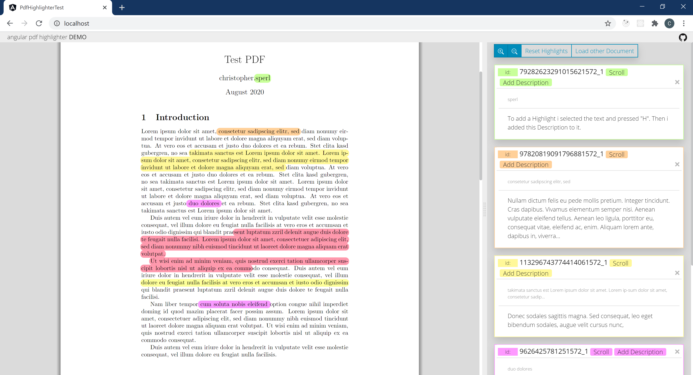

# PdfHighlighter

This project was generated with [Angular CLI](https://github.com/angular/angular-cli) version 10.0.1.

## Get Started:

- npm install
- npm run start
- (npm run dev)

## Build:

- npm run build

## Screenshot of UI:

## Prior Art:

- https://github.com/VadimDez/ng2-pdf-viewer [1](#myfootnote1)
- https://github.com/agentcooper/react-pdf-highlighter [2](#myfootnote2)

<a name="myfootnote1">1</a>: I used ng2-pdf-viewer to wrap pdf.js and get some events.

<a name="myfootnote2">2</a>: I looked at this superior Project, to get an Idea of how to calculate the Position of the Selected Text on an PDF.
